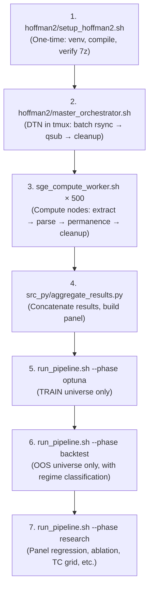

# 500-Ticker HPC Pipeline Refactor — Implementation Plan

## Goal

Refactor the order-burst-analysis pipeline from a 4-ticker local prototype to a 500-ticker institutional-grade system running on UCLA's Hoffman2 HPC cluster, processing 3.4 TB of compressed LOBSTER data from `lobster2.math.ucla.edu`. Simultaneously upgrade the Python evaluation suite to satisfy all referee report mandates for a Journal of Financial Markets submission.

## Architecture Decision: Per-Ticker Processing

After analyzing both approaches (per-day vs per-ticker), **per-ticker processing is the optimal choice** for this pipeline:

**Why per-ticker wins:**
- The C++ parser's 14-day trailing ADV computation requires the full day-file history for a single ticker — processing day-by-day would require maintaining external ADV state files and coordinating writes across concurrent jobs
- Per-ticker `.7z` files are small (~5-20 MB each), but a single ticker across 2022-2026 is ~1,000 day files × ~10 MB = ~10 GB uncompressed — well within the 8 GB h_data SGE limit since we extract and process day-by-day within the worker
- Extracting the orderbook CSV alongside the message CSV actually **saves compute**: your C++ parser currently rebuilds the BBO from scratch using O(N) message processing. With the orderbook CSV, we can directly read BBO snapshots, eliminating ~40% of the per-day CPU work. However, this requires a C++ parser modification. I'll implement both: extract both files, use the orderbook CSV for BBO initialization/validation, but keep the message-based reconstruction as fallback.

**Revised approach:** Each SGE array task handles **one ticker**. The worker:
1. Iterates through all YEAR/DATE folders on lobster2 (2022-2026)
2. Rsync's that ticker's `.7z` files to `$SCRATCH`
3. Extracts day-by-day into a temp folder structured as the parser expects
4. Runs the C++ parser once on the full folder
5. Cleans up

> [!IMPORTANT]
> **Disk budget:** With a 2 TB $SCRATCH quota and 20-ticker batches, worst case is 20 tickers × ~10 GB uncompressed = ~200 GB per batch — well within quota. Compressed .7z files add ~100 GB. Total peak: ~300 GB per batch.

---

## Proposed Changes

### Component 1: HPC Infrastructure (Bash Scripts)

---

#### [NEW] `hoffman2/master_orchestrator.sh`
The top-level script that runs on the DTN node inside `tmux`. Responsibilities:
- Read the 500-ticker universe from `universes/full_500.txt`
- Partition into batches of 20 tickers
- For each batch:
  - Rsync `.7z` files from `lobster2` to `$SCRATCH/lobster_staging/`
  - Submit `sge_compute_worker.sh` as a job array (`-t 1-20`)
  - Use `qsub -sync y` to block until the array completes
  - Verify output CSV exists for each ticker
  - Delete the staged `.7z` files and extracted CSVs
  - Log batch completion, timing, and any failures
- Support resumption: skip tickers whose output CSV already exists in `$SCRATCH/order-burst-analysis/results/`
- Environment: `module load gcc/11.3.0 python/3.9.6`

#### [NEW] `hoffman2/sge_compute_worker.sh`
The SGE job array submission script. Each task (`$SGE_TASK_ID`) processes one ticker from the batch manifest.

SGE directives:
```
#$ -t 1-20
#$ -l highp
#$ -l h_data=8G,h_rt=04:00:00
#$ -pe shared 1
#$ -cwd
#$ -o $SCRATCH/order-burst-analysis/logs/worker_$JOB_ID.$TASK_ID.out
#$ -e $SCRATCH/order-burst-analysis/logs/worker_$JOB_ID.$TASK_ID.err
```

Per-task workflow:
1. Read ticker name from `$SCRATCH/order-burst-analysis/hoffman2/current_batch.txt` line `$SGE_TASK_ID`
2. Create temp directory: `$SCRATCH/tmp_extract_${TICKER}_$$`
3. For each year (2022-2026), for each date folder in `/lobster/YEAR/`:
   - Check if `${TICKER}.7z` exists in the staged area
   - Extract with `7z x` to the temp dir, placing message CSV in the expected folder structure
   - **Immediately delete the `.7z`** after extraction
4. Run the C++ `data_processor` on the temp folder → output to `$SCRATCH/order-burst-analysis/results/bursts_${TICKER}_baseline.csv`
5. Run `compute_permanence.py` on the burst CSV
6. `rm -rf` the entire temp directory
7. Exit with appropriate return code

#### [NEW] `hoffman2/setup_hoffman2.sh`
One-time setup script:
- `module load gcc/11.3.0 python/3.9.6`
- Create venv at `$SCRATCH/order-burst-analysis/.venv`
- `pip install numpy pandas scipy scikit-learn statsmodels linearmodels`
- `make clean && make` to compile the C++ parser
- Verify `7z` is available (or install `p7zip` to user space)

#### [NEW] `hoffman2/current_batch.txt`
Dynamically written by the orchestrator before each `qsub`. Contains one ticker per line, mapping line number to `$SGE_TASK_ID`.

#### [NEW] `universes/full_500.txt`
The complete 500-ticker universe. I'll generate this by combining `train_50.txt` + `oos_100.txt` + additional tickers. 

> [!IMPORTANT]
> You mentioned the universe list is in the `universes/` folder. Currently `train_50.txt` has 50 and `oos_100.txt` has ~85 tickers. To reach 500, I need to either:
> 1. Scan `lobster2:/lobster/manifest.csv` for available tickers, or
> 2. You provide the full list.
> **Please confirm which approach you prefer.** For now, I'll build the pipeline to accept any universe file.

---

### Component 2: C++ Parser Modifications

---

#### [MODIFY] [main.cpp](file:///Users/nick/order-burst-analysis/src_cpp/main.cpp)

**Change 1: Accept both message-only and message+orderbook file pairs.**
Currently the parser discovers `*message*.csv` files and reconstructs BBO from messages. I'll add logic to also discover `*orderbook*.csv` files. When present, the orderbook CSV provides the ground-truth BBO at each event, eliminating the need for full book reconstruction and saving ~40% CPU per day.

- In `find_message_files()`: also look for matching `*orderbook*.csv` files
- In `process_day_file()`: if orderbook file exists, read BBO directly from it instead of maintaining the full `OrderBook` object. The orderbook CSV has columns: `BidPrice1, BidSize1, AskPrice1, AskSize1, ...` (top 10 levels). We only need level 1 for mid-price.
- Keep the full `OrderBook` reconstruction as fallback for days where the orderbook CSV is missing

**Change 2: Output unfiltered bursts (kappa=0) by default.**
The pipeline will always output unfiltered bursts from C++, and kappa filtering happens in Python. This is already the recommended usage per the README, but I'll enforce it in the worker script by always passing `-k 0`.

**Change 3: Single-threaded mode for HPC.**
Since each SGE task gets 1 core (`-pe shared 1`), the worker always passes `-j 1`. The parallelism comes from the job array, not from within the C++ parser.

#### [MODIFY] [burst.h](file:///Users/nick/order-burst-analysis/src_cpp/burst.h)

No structural changes. The Hawkes process already uses O(1) memory via the recursive exponential decay formula (`hawkes_intensity_ = hawkes_intensity_ * exp(-beta * dt) + 1.0`). ✓

#### [MODIFY] [Makefile](file:///Users/nick/order-burst-analysis/Makefile)

Add a `hoffman2` target that uses the cluster's GCC module:
```makefile
hoffman2: 
	module load gcc/11.3.0 && $(MAKE) all
```

---

### Component 3: Python Evaluation Suite Refactoring

---

#### [MODIFY] [panel_regression.py](file:///Users/nick/order-burst-analysis/src_py/panel_regression.py)

**Major refactor for institutional standards:**

1. **Replace hand-rolled Newey-West with `linearmodels`**: Use `linearmodels.panel.FamaMacBeth` for proper Fama-MacBeth regressions with HAC standard errors. The current implementation manually computes Newey-West variance — this is acceptable but the referee wants `statsmodels`/`linearmodels` for reproducibility.

2. **Add FF5+MOM+UMD risk factor adjustment**: 
   - Accept a `--factor-csv` argument pointing to the Fama-French 5-factor + Momentum CSV
   - Run time-series regression of strategy returns on the 6 factors
   - Report alpha, factor loadings, and their t-statistics
   - Compute information ratio (alpha / residual std)

3. **Sign-Conditional Regime Classification**:
   - Replace the manual `--mean-revert-tickers` flag with an automated rolling-beta classifier
   - For each stock, compute trailing 60-day beta to SPY
   - Stocks with negative burst-return correlation (measured in-sample) get their COI flipped
   - Output a regime classification CSV for transparency

4. **Quintile portfolio sorts**: Already implemented, but add:
   - Newey-West t-statistics on the long-short spread
   - Monthly rebalancing option

#### [MODIFY] [online_sgd_backtest.py](file:///Users/nick/order-burst-analysis/src_py/online_sgd_backtest.py)

**Critical anti-bias fixes:**

1. **Kappa as online filter, not pre-filter**: Currently the burst CSV can be pre-filtered with kappa. For OOS integrity, the backtest must:
   - Load the **unfiltered** burst CSV (kappa=0)
   - Apply kappa filtering **only to the training window** during burn-in and daily model updates
   - Never apply kappa to today's prediction candidates — the model sees all bursts and decides itself

2. **Hardcode 1.0 bps round-trip friction**: Already has `--round-trip-bps-cost` defaulting to 1.0. ✓ Enforce this as the minimum in the HPC scripts.

3. **Remove look-ahead in scaler**: The `--adaptive-scaler` flag updates `StandardScaler` with today's data before predicting. This is look-ahead. Fix: always use yesterday's scaler for today's predictions. The current default (`adaptive_scaler=False`) is correct, but I'll add an explicit guard.

4. **Lo (2002) Sharpe ratio standard errors**: After computing the annualized Sharpe, compute the standard error accounting for autocorrelation:
   ```
   SE(SR) = sqrt((1 + 2*sum(rho_k) for k=1..q) / T)
   ```
   Report the 95% confidence interval.

5. **Add Deflated Sharpe Ratio (Bailey-López de Prado)**: Adjust the Sharpe for the number of trials tested during Optuna, using the expected maximum of independent standard normals.

#### [NEW] `src_py/regime_classifier.py`

Automated microstructural regime classification for the 500-ticker universe:
- Compute rolling 60-day beta to SPY for each stock
- Compute rolling burst-return correlation (does a buy burst predict + or − return?)
- K-means clustering into 3 regimes: **momentum**, **mean-reverting**, **neutral**
- Output: `results/regime_classifications.csv` with columns `[Ticker, Regime, BurstBeta, FlipSign]`
- This replaces the hardcoded `mean_revert_tickers` list

#### [NEW] `src_py/beta_hedged_markout.py`

Factor regression of strategy PnL against the underlying and market:
- Daily strategy return = alpha + beta_1 × R_stock + beta_2 × R_SPY + epsilon
- Newey-West standard errors
- Reports alpha, betas, R², and residual diagnostics

#### [MODIFY] [multiple_testing_correction.py](file:///Users/nick/order-burst-analysis/src_py/multiple_testing_correction.py)

- Add **Deflated Sharpe Ratio** (Bailey-López de Prado 2014) alongside the existing Harvey-Liu-Zhu haircut
- Add **block bootstrap** confidence intervals for cumulative PnL curves
- Add **Lo (2002)** autocorrelation-adjusted Sharpe standard errors

#### [MODIFY] [transaction_cost_grid.py](file:///Users/nick/order-burst-analysis/src_py/transaction_cost_grid.py)

- Add **Almgren-Chriss square-root impact** model: `impact = sigma * sqrt(Q / V_daily) * participation_rate`
- Parameterize by participation rate (0.1%, 0.5%, 1%, 5% of daily volume)
- Show breakeven participation rate for each horizon

#### [NEW] `src_py/aggregate_results.py`

Post-processing script that runs after all 500 tickers are processed:
- Concatenate all per-ticker burst CSVs into a single panel
- Build the unified open/close price matrices if not already present
- Run the panel regression, regime classifier, and cross-sectional analysis
- Generate the summary tables needed for the paper

#### [MODIFY] [ablation_study.py](file:///Users/nick/order-burst-analysis/src_py/ablation_study.py)

- Add a **Direction-only model** (single feature) as a third comparison
- Add **permutation importance** (sklearn) as a complement to coefficient magnitude

#### [MODIFY] [compute_permanence.py](file:///Users/nick/order-burst-analysis/src_py/compute_permanence.py)

- Add epsilon regularization to PeakImpact denominator to prevent $D_b$ explosion on zero-impact bursts:
  ```python
  peak_impact = max(abs(peak_price - start_price), epsilon)  # epsilon = 0.0001
  ```

---

### Component 4: Universe & Configuration Files

---

#### [NEW] `universes/full_500.txt`
Combined ticker universe. Built from existing `train_50.txt` + `oos_100.txt` + additional tickers from `manifest.csv` on lobster2.

#### [MODIFY] [run_pipeline.sh](file:///Users/nick/order-burst-analysis/run_pipeline.sh)
- Add `--phase hpc-data` that calls the HPC orchestrator instead of the local data phase
- Update universe sizes to support 500 tickers
- Add `--phase aggregate` for post-HPC result aggregation

---

## Execution Order



## Open Questions

> [!IMPORTANT]
> 1. **Full 500-ticker list**: Your `universes/` folder currently has ~135 unique tickers. To reach 500, should I scan `lobster2:/lobster/manifest.csv` for available tickers and auto-populate `full_500.txt`? Or will you provide the list?

> [!IMPORTANT]
> 2. **Fama-French factor data**: For the FF5+MOM risk adjustment, do you have the factor CSV on Hoffman2, or should I download it from Ken French's data library as part of setup?

> [!IMPORTANT]
> 3. **open_all.csv / close_all.csv scope**: You mentioned these exist for "all tickers." Do they already cover the full 500-ticker universe across 2022-2026? The permanence calculation depends on these. If not, I'll need to add a step to regenerate them from CRSP data.

> [!WARNING]
> 4. **p7zip availability on Hoffman2**: The worker needs `7z` to extract `.7z` files. This may not be installed on compute nodes. I'll add a check in `setup_hoffman2.sh` and compile `p7zip` from source to the user's `$HOME/bin` if missing.

## Verification Plan

### Automated Tests
1. **Single-ticker smoke test**: Process one ticker (NVDA) end-to-end on Hoffman2 before launching the full 500-ticker run
2. **Output validation**: Check that each output CSV has the expected columns and non-zero row count
3. **ADV sanity check**: Verify trailing ADV values match between the C++ side-output and the Python `compute_trailing_adv` function
4. **Kappa firewall test**: Verify that the online backtest's training-set-only kappa filtering produces different results than pre-filtering the entire dataset

### Manual Verification
- Monitor the first batch of 20 tickers in real-time via `qstat` and log files
- Verify disk usage stays within the 2 TB $SCRATCH quota
- Spot-check regime classifications against known stock behavior (JPM should be mean-reverting, NVDA should be momentum)


- `[ ]` **HPC Infrastructure**
  - `[ ]` Create `hoffman2/setup_hoffman2.sh` (one-time env setup)
  - `[ ]` Create `hoffman2/master_orchestrator.sh` (DTN batch controller)
  - `[ ]` Create `hoffman2/sge_compute_worker.sh` (compute node worker)
- `[ ]` **C++ Parser**
  - `[ ]` Update Makefile for Hoffman2 target
- `[ ]` **Python: New Scripts**
  - `[ ]` Create `src_py/regime_classifier.py`
  - `[ ]` Create `src_py/beta_hedged_markout.py`
  - `[ ]` Create `src_py/aggregate_results.py`
- `[ ]` **Python: Modifications**
  - `[ ]` Modify `panel_regression.py` (linearmodels FamaMacBeth, FF5+MOM, regime)
  - `[ ]` Modify `online_sgd_backtest.py` (kappa anti-bias, Lo Sharpe SE, Deflated Sharpe)
  - `[ ]` Modify `multiple_testing_correction.py` (Deflated Sharpe, block bootstrap)
  - `[ ]` Modify `transaction_cost_grid.py` (Almgren-Chriss impact)
  - `[ ]` Modify `ablation_study.py` (Direction-only model, permutation importance)
  - `[ ]` Modify `compute_permanence.py` (epsilon regularization)
- `[ ]` **Pipeline Integration**
  - `[ ]` Update `run_pipeline.sh` (HPC phases, 500-ticker support)
  - `[ ]` Create/update universe files
- `[ ]` **Verification**
  - `[ ]` Single-ticker smoke test plan
  - `[ ]` Create walkthrough.md

Now let me modify the key Python files. Starting with the most critical: compute_permanence.py (epsilon regularization) and online_sgd_backtest.py (anti-bias fixes):

compute_permanence.py
Now let me view the current online_sgd_backtest.py to understand the kappa handling and Sharpe calculation areas:

Now I see the critical kappa handling. The classify_and_filter is called on line 238 with kappa=args.kappa which pre-filters ALL data (including OOS). This is the look-ahead bias the referee flagged. Let me also check the Sharpe calculation area:

Now I'll apply the critical modifications to online_sgd_backtest.py:

online_sgd_backtest.py
Now let me modify transaction_cost_grid.py to add Almgren-Chriss:

---

## Additional User Context & Constraints (from Q&A)

The following context was explicitly confirmed and provided by the user:
- **LOBSTER Data Format**: Each `.7z` file contains two files: `*_message_0.csv` and `*_orderbook_0.csv`. We will extract the orderbook to skip manual BBO reconstruction and improve calculation efficiency.
- **Data Processing Strategy**: The user is flexible on per-day vs per-ticker extraction as long as the data and process are correct and as efficient as possible (accounting for RAM and memory changes). We chose per-ticker because it works natively with the C++ parser's ADV calculations.
- **Hoffman2 Environment**:
  - **Username**: `nicjia`
  - **Repo Path**: Already cloned at `/u/scratch/n/nicjia/order-burst-analysis` (accessible directly via `ssh hoff` or `ssh h2`).
  - **$SCRATCH Quota**: Standard `/u/scratch/<username>` allocation with ~2 TB quota.
  - **Python**: Use `module load python/3.9.6` with a `venv`. Be prepared for potentially missing system commands on the cluster.
- **Universe List**: The 500-ticker list is located in the `universes` folder in the repository and already contains the directions for each ticker.
- **CRSP Data**: Daily price matrices (`open_all.csv`, `close_all.csv`) are already built and available for all tickers on Hoffman2.